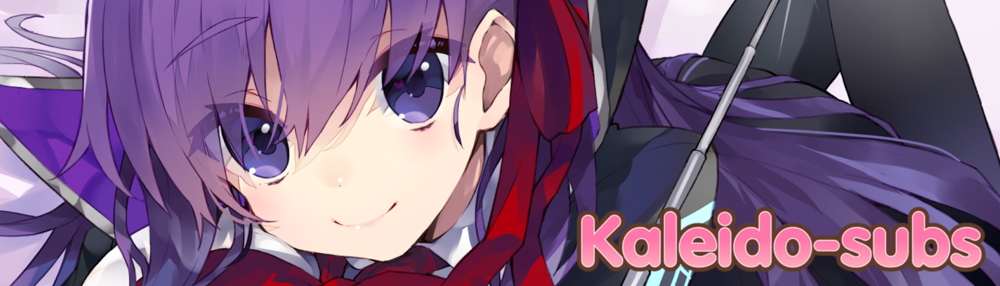
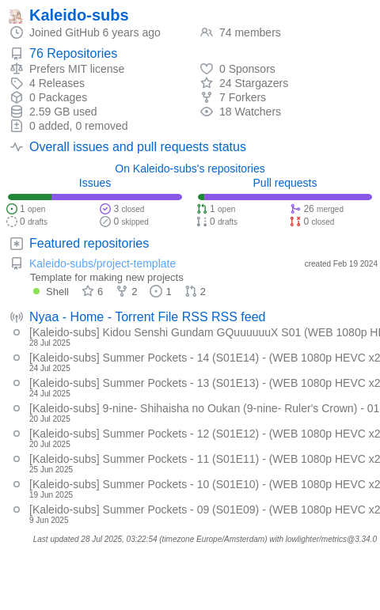

<!-- TO-DO: Figure out why <style> tags don't work -->

    </img>

<h3 align="center">Connect with us!</h3>

    
    <!--  -->
    
    
    

    

Kaleido is a fansub group aimed at high-quality translation and localisation, alongside high video- and typesetting
quality, no matter how long it may take.

Kaleido operates primarily through a freelancer-style model. We have a few core members, and connect with other fansubbing
peers to work on projects. This opens the doors to both veteran and green fansubbers to try their hands at projects and
create some fansubs.

We're very open to collaborations and open-source fansubbing projects! All our finalised releases will be publicly
available in this organisation, and you are free to create your own forks to build upon them as you'd like. Full credit
is not required, but we would appreciate it!

As these repositories are public, you can leave Issues and Pull Requests to let us know about any problems in our
subtitles or send in your own fixes!

Want to work with Kaleido? We can try to work something out! Contact us through
<a href=https://discord.com/servers/stalleido-subs-443264565069742080 target="_blank">Discord</a>, and if there is staff interest, we can continue talks
and see what sprouts out of it!

    

<!-- TODO: Make deschtimes progress visible here somehow or another? Shinon? -->

<h3 align="center"> Frequently Asked Questions</h3>

When will X be done?

<ul>
    <li>
    We're done when we're done, simple as that really. If you want specific details on what the hold-up may be, please
    check our <a href="https://kaleido.kageru.moe/" target="_blank">main website</a> for the Deschtimes feed, or feel
    free to ask in our <a href="https://discord.com/servers/stalleido-subs-443264565069742080" target="_blank">Discord server</a> (and if you have the
    relevant expertise, please do not hesitate to apply!).
    </li>
</ul>

How do I build your subtitles?

<ul>
    <li>
    We use a tool called <a href=https://github.com/TypesettingTools/SubKt target="_blank">SubKt</a> to build all our subtitle
    scripts. You can build the subtitles by running <code>./gradlew merge.01`</code> (or other episodes). For muxing,
    you must make sure the name of the encode you'd like to mux with matches the "premux" property of the project (check
     `<code>sub.properties</code>), and then run <code>./gradlew mux.01</code>. For further questions, please check out
     the official <a href="https://github.com/TypesettingTools/SubKt" target="_blank">SubKt documentation</a>.
    </li>
</ul>

Can I translate your translation into another language?

<ul>
    <li>
    By all means, please do! Credit would be much appreciated if you make use of our subtitles. You may also want to
    make sure to update the <code>sub.properties</code> before you start building your subtitles.
    </li>
</ul>

Will you translate X or Y for me?

<ul>
    <li>
    We do not currently accept specific subbing requests. If you're interested in doing it as a project, we may consider
    doing it if there's staff interest and you already have some staff of your own.
    </li>
</ul>

